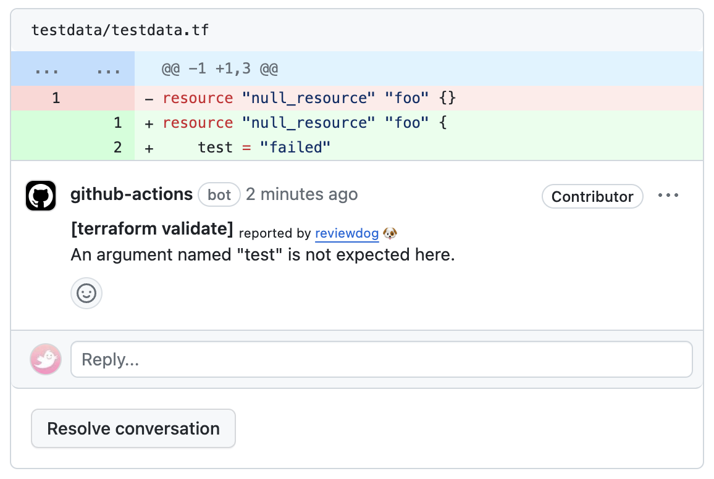
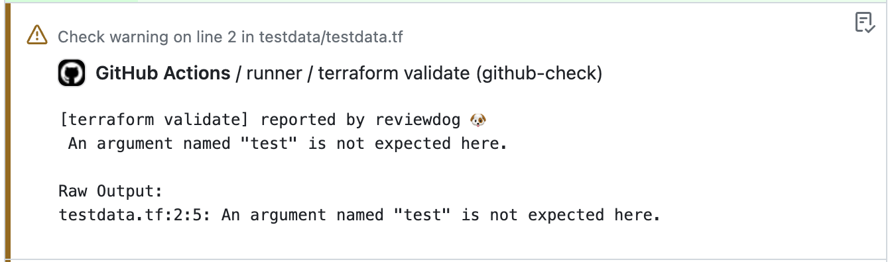

# action-terraform-validate

[](https://github.com/maruLoop/action-terraform-validate/actions?query=workflow%3ATest)
[](https://github.com/maruLoop/action-terraform-validate/actions?query=workflow%3Areviewdog)
[](https://github.com/maruLoop/action-terraform-validate/actions?query=workflow%3Adepup)
[](https://github.com/maruLoop/action-terraform-validate/actions?query=workflow%3Arelease)
[](https://github.com/maruLoop/action-terraform-validate/releases)
[](https://github.com/haya14busa/action-bumpr)




This action runs [terraform validate](https://developer.hashicorp.com/terraform/cli/commands/validate) with [reviewdog](https://github.com/reviewdog/reviewdog) on pull requests to improve experience.

## Input

```yaml
inputs:
  github_token:
    description: 'GITHUB_TOKEN'
    default: '${{ github.token }}'
  workdir:
    description: 'Working directory relative to the root directory.'
    default: '.'
  ### Flags for reviewdog ###
  level:
    description: 'Report level for reviewdog [info,warning,error]'
    default: 'error'
  reporter:
    description: 'Reporter of reviewdog command [github-pr-check,github-check,github-pr-review].'
    default: 'github-pr-check'
  filter_mode:
    description: |
      Filtering mode for the reviewdog command [added,diff_context,file,nofilter].
      Default is added.
    default: 'added'
  fail_on_error:
    description: |
      Exit code for reviewdog when errors are found [true,false]
      Default is `false`.
    default: 'false'
  reviewdog_flags:
    description: 'Additional reviewdog flags'
    default: ''
  ### Variables for Terraform  ###
  terraform_version:
    description: 'The terraform version to install and use.'
```

## Usage

```yaml
name: reviewdog
on: [pull_request]
jobs:
  terraform_validate:
    name: runner / terraform validate
    runs-on: ubuntu-latest
    steps:
      - uses: actions/checkout@v4
      - uses: maruloop/action-terraform-validate@v1
        with:
          github_token: ${{ secrets.github_token }}
          # Change reviewdog reporter if you need [github-pr-check,github-check,github-pr-review].
          reporter: github-pr-review
          # Change reporter level if you need.
          # GitHub Status Check won't become failure with warning.
          level: warning
```
